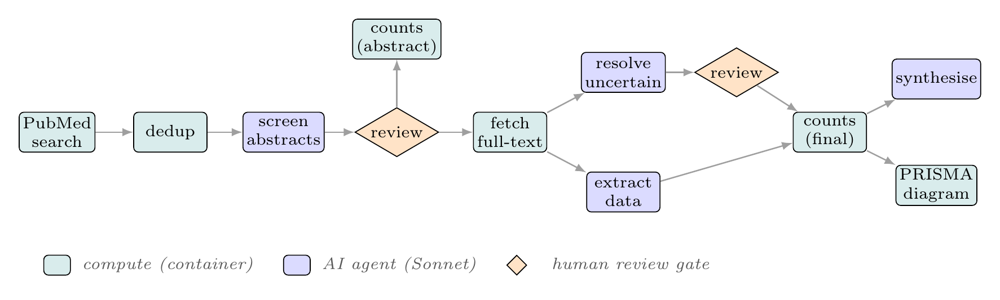
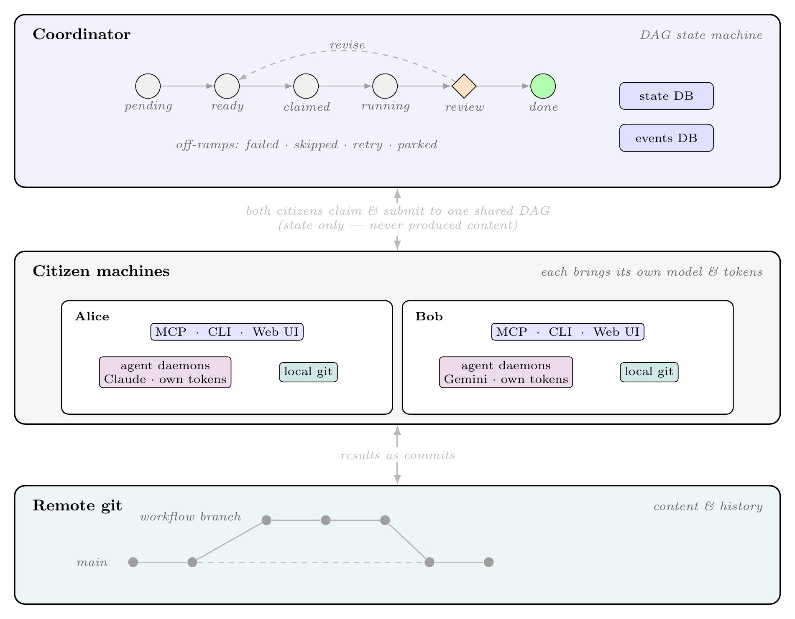
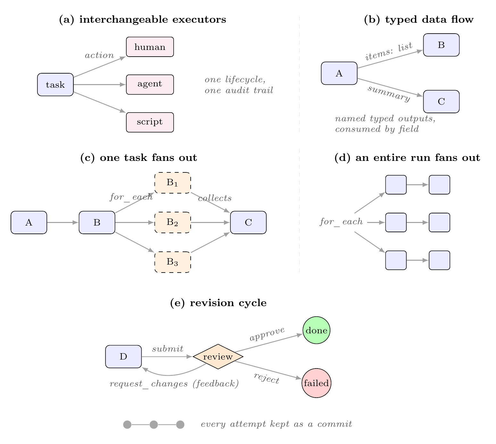

# Enju (槐)

**Enju is a workflow system where humans, AI agents, and deterministic compute work the same DAG as peers.** The unit of work is a **task** — something any of them can `answer`, `review`, `vote` on, or `compute`. The graph is *live*: a task can spawn more tasks while a run is in flight, so a review that returns `request_changes` drops a revision task back into the graph with its feedback already attached, and the work cycles until it's approved.

What makes this work is where the lines are drawn. Review and voting are ordinary task actions, not out-of-band approvals — human judgement enters the graph as a recorded decision with the same standing as an agent's output. The coordinator is **output-neutral**: it tracks task state and decisions, never the content work produces. Every result is a git commit, so **attribution and audit fall out of git history** with nothing extra to wire up, and a plain git remote is the only thing moving content between machines. Enju ships as a single binary that speaks MCP, a CLI, and a web UI.

<p align="center"></p>
<p align="center"><em>A real Enju workflow — a PRISMA systematic review — where deterministic compute (teal), AI agents (blue), and human review gates (orange) are peers on one graph.<br>Any citizen can claim from this graph in parallel, each on its own model and tokens.</em></p>

## What a workflow looks like

A workflow is a DAG of tasks, written as YAML and committed to your repo. Here an agent drafts a report and a human gates it — two tasks, two different kinds of citizen, one graph:

```yaml
name: My First Workflow

agents:
  - name: writer
    handler: claude
    model: claude-sonnet-4-6

tasks:
  - id: write_report
    action: answer            # an agent (or a human) produces work
    assign_to: writer
    writes: [report.md]
    prompt: Write a short report on solar-energy adoption to report.md.

  - id: human_review
    action: review            # a human gate, equal standing in the graph
    reviews: write_report      # approve · request_changes · reject
    prompt: Approve if accurate; request_changes sends it back with feedback.
```

```sh
enju go enju.yaml --auto-agents
```

The agent claims `write_report`, runs its model, and commits `report.md`; `human_review` then waits in your inbox. Every step is a commit on the run's branch. → full walkthrough in the [quickstart](docs/getting-started/quickstart.md).

## How it fits together

<!-- ARCHITECTURE: PNG rendered from preprint Figure 1 -->
<p align="center"></p>

The **coordinator** holds the task DAG and its lifecycle (`pending → ready → claimed → running → review → done`, with a revise loop) plus the state and events databases — but no produced content. Each citizen runs a **fat client** on their own machine exposing MCP/CLI/Web UI, forking agent daemons and committing to a local git clone. Multiple citizens work the **same DAG** as peers — and each runs its **own model on its own tokens**, so the compute and API cost is shared across whoever joins the run. **Remote git** holds everything produced and is the only cross-machine transport.

<!-- TASK MODEL: PNG rendered from preprint Figure 2 -->
<p align="center"></p>

One primitive, interchangeable executors: a task's `action` selects whether a human, an LLM agent, or a script runs it — all the same kind of node. Edges carry typed data, `for_each` fans a task (or a whole run) out into parallel iterations, and a `review` verdict can approve, fail, or cycle the work back with feedback — every attempt kept as a commit.

## Quick install

```sh
curl -fsSL https://raw.githubusercontent.com/tamerh/enju/main/install.sh | sh
```

Installs `enju` to `~/.local/bin/enju` (no sudo). Add it to your `PATH` if it isn't already:

```sh
echo 'export PATH="$HOME/.local/bin:$PATH"' >> ~/.bashrc   # or ~/.zshrc
```

Verify with `enju --version`.

**Other platforms or specific versions:** download a binary from the [releases page](https://github.com/tamerh/enju/releases) and put it on your `PATH`.

## Examples

Three reference workflows — clone, install, run:

- **[mustache-engine-enju](https://github.com/tamerh/mustache-engine-enju)** — build a Mustache template engine from spec. Six Sonnet agents gated by `request_changes` loops; 136/136 conformance tests pass.
- **[prisma-review-enju](https://github.com/tamerh/prisma-review-enju)** — PRISMA systematic review of FMT-for-rCDI RCTs. Four Sonnet agents + two human review gates produce a 14-RCT synthesis.
- **[nanopore-assembly-enju](https://github.com/tamerh/nanopore-assembly-enju)** — ONT phage-genome assembly. Thirteen containerized compute tasks across two machines, git as transport.

## Docs

See [docs/](docs/) — [getting started](docs/getting-started/), [guides](docs/guides/), [reference](docs/reference/), or [how it works](docs/how-it-works.md).

For the design and motivation, see the preprint: [sugi.bio/enju](https://sugi.bio/enju).

## License

MIT — see [LICENSE](LICENSE).
