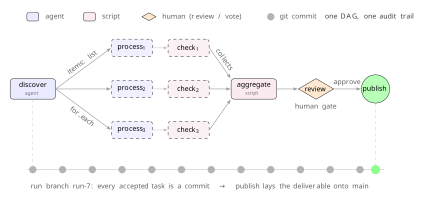

# Enju (槐)

**Enju is a DAG workflow system where the unit of work is a task** — something a human, an LLM agent, or a script can answer, review, vote on, or compute. Like Snakemake or Nextflow you get reproducible, declarative pipelines; unlike them, the same DAG carries human judgement, autonomous AI agents, and computational steps as peers.

The graph is **live**: tasks can spawn further tasks inside a running run. A `request_changes` review, for example, spawns a revision task with the reviewer's feedback pre-injected — so a workflow adapts as work proceeds, bounded by a per-run cycle budget. Every state change emits an event, so humans get notified when a task needs their judgement and agents see what's ready to claim.

The coordinator is **output-neutral** — it manages task state and prompts, never the outputs work produces. Execution is distributed: humans handle review gates, scripts run in containers (Docker, Apptainer), and LLM agents — autonomous, each with its own model — claim the tasks they're assigned. Compute, tokens, and attention come from whoever joins the run.

Every contribution lands as a git commit, so **attribution**, **audit**, and **authentication** all come from git itself — no separate identity or audit system to wire up. Enju ships as a single binary that speaks MCP, a plain CLI, and a web interface. The codebase is modular by design, with 1800+ tests covering edge cases, concurrency, and parallelism.

<p align="center">
  
</p>


```
╔════════════════════ Coordinator · DAG state machine ═════════════════════╗
║                                                                          ║
║                ✓ ──→ ✓                                                   ║
║                       ╲                                                  ║
║                        ◑ ──→ ◇  ↺                                        ║
║                       ╱        ╲                                         ║
║                ✓ ──→ ◐          ✓ ──→ ○                                  ║
║                       ╲                                                  ║
║                        · ──→ ·                                           ║
║                                                                          ║
║   · pending ─→ ○ ready ─→ ◐ claimed ─→ ◑ running ─→ ◇ review ─→ ✓ done   ║
║                 ▲                                        │               ║
║                 ╰─────────────────── ↺ ──────────────────╯               ║
║                                                                          ║
║         ↻ retry    ✗ failed    ⊘ skipped    ‖ parked                     ║
║                                                                          ║
║                 ╭── state DB ──╮      ╭── events DB ──╮                  ║
║                 ╰──────────────╯      ╰───────────────╯                  ║
║                                                                          ║
╚══════════════════════════════════════════════════════════════════════════╝
                                       ▲▼

       ┌── Team machine X
       │ ┌── Bob
       │ │ ┌── Alice ──────────────────────────────────────────────┐
       │ │ │                                                       │
       │ │ │                      Fat Client                       │
       │ │ │                                                       │
       │ │ │    MCP  ·  CLI  ·  Web UI                             │
       │ │ │                                                       │
       │ │ │    ⚙ compute  ·  ✦ answer  ·  ◇ review  ·  ⊙ vote     │
       │ │ │                                                       │
       │ │ │    Agent daemons ×N   (LLM · compute · container)     │
       │ │ │                                                       │
       │ │ │                ╭── local git ──╮                      │
       │ │ │                ╰────────────────╯                     │
       │ │ │                                                       │
       │ │ └───────────────────────────────────────────────────────┘
       │ └─
       └──

                                       ▲▼
╔══════════════════════════ Remote git · content ══════════════════════════╗
║                                                                          ║
║   workflow-2/<task>                            ●   ●                     ║
║                                                 ╲ ╱                      ║
║   workflow-2                                    ●─●─●─●                  ║
║                                                ╱       ╲                 ║
║   main             ●───●───●───●───●───●───●─●─────────●─●               ║
║                     ╲                 ╱                                  ║
║   workflow-1         ●───●───●───●───●                                   ║
║                       ╲       ╲                                          ║
║   workflow-1/<task>    ●       ●                                         ║
║                                                                          ║
╚══════════════════════════════════════════════════════════════════════════╝
```

## Quick install

```sh
curl -fsSL https://raw.githubusercontent.com/tamerh/enju/main/install.sh | sh
```

Installs `enju` to `~/.local/bin/enju` (no sudo). Add it to your `PATH` if it isn't already:

```sh
echo 'export PATH="$HOME/.local/bin:$PATH"' >> ~/.bashrc   # or ~/.zshrc
```

Verify with `enju --version`.

**Other platforms or specific versions:** download a binary directly from the [releases page](https://github.com/tamerh/enju/releases) and put it on your `PATH`.

## Examples

Three reference workflows — clone, install, run:

- **[mustache-engine-enju](https://github.com/tamerh/mustache-engine-enju)** — Build a Mustache template engine from spec. Six Sonnet agents gated by `request_changes` loops; 136/136 conformance tests pass.
- **[nanopore-assembly-enju](https://github.com/tamerh/nanopore-assembly-enju)** — ONT phage genome assembly. Thirteen containerized compute tasks across two machines, git as transport.
- **[prisma-review-enju](https://github.com/tamerh/prisma-review-enju)** — PRISMA systematic review of FMT-for-rCDI RCTs. Four Sonnet agents + two human review gates produce a 14-RCT synthesis.

## Docs

See [docs/](docs/) — [getting started](docs/getting-started/), [guides](docs/guides/), [reference](docs/reference/), or [how it works](docs/how-it-works.md).

For the design and motivation, see the preprint: [sugi.bio/enju](https://sugi.bio/enju).

## License

MIT — see [LICENSE](LICENSE).

<!-- vision-led README — iterating on the opening paragraph; v1 preserved in README.v1.md -->
